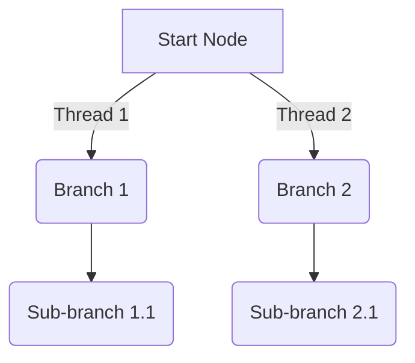
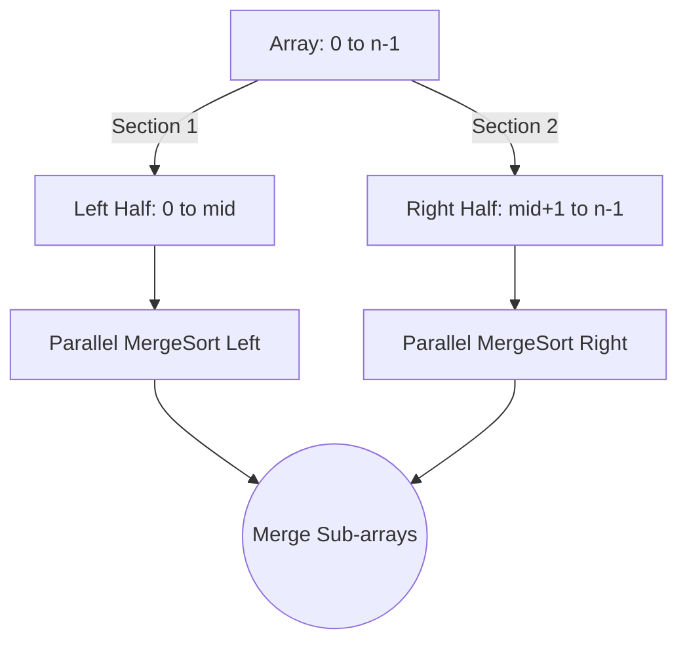
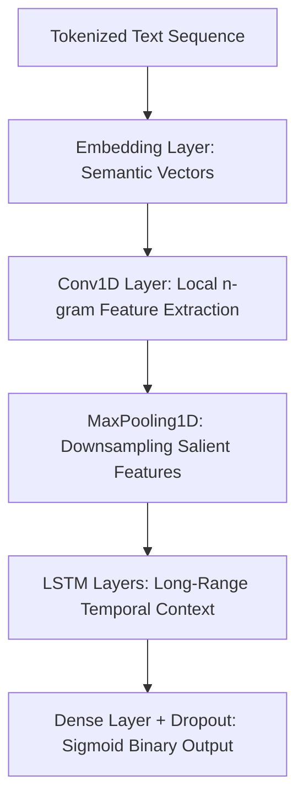

# Technical Explanations of Practicals

This document provides deep technical explanations, core architectural workflows, and parallelization/modeling strategies for each practical included in the High Performance Computing (HPC) and Deep Learning (DL) coursework repository.

---

## 🚀 Part I: High Performance Computing (HPC)

### 1a. Parallel Depth First Search (DFS) using OpenMP
* **Source Path:** `hpc/1a-dfs.cpp`

#### Core Concepts & Parallelization Strategy
Standard Depth First Search (DFS) explores a graph by diving as deep as possible along each branch before backtracking. Since DFS traversal path depends heavily on previously visited nodes, parallelizing it requires distributing recursive branch explorations across available CPU threads.



1. **Graph Representation:** The graph is structured using an adjacency list backed by an `unordered_map<int, vector<int>>` for fast edge lookups.
2. **Critical Section Synchronization (`#pragma omp critical`):**
   When a thread reaches a node, it must verify whether the node has been visited and subsequently mark it as visited. To avoid **race conditions**—where multiple threads concurrently access and modify the `visited` map for the same node—this operation block is protected by an OpenMP critical section.
3. **Task Distribution (`#pragma omp parallel for`):**
   Once a node is marked visited, its outgoing edges (neighbors) are iterated over. The `#pragma omp parallel for` directive splits the iteration space of these neighbors among multiple spawned threads. Each thread takes ownership of a subset of outgoing edges and recursively executes `parallelDfs` on unvisited neighbors concurrently.

---

### 1b. Parallel Breadth First Search (BFS) using OpenMP
* **Source Path:** `hpc/1b-bfs.cpp`

#### Core Concepts & Parallelization Strategy
Breadth First Search (BFS) traverses a graph level-by-level (or frontier-by-frontier) starting from a source vertex, utilizing a First-In-First-Out (FIFO) queue.

1. **Frontier-Based Parallelism:** 
   The outer `while` loop checks if the shared queue `q` is empty. At the start of each depth level, the algorithm captures the total number of nodes currently residing in the frontier using `int size = q.size();`.
2. **Concurrent Loop Execution (`#pragma omp parallel for`):**
   The nodes belonging to the current frontier are processed simultaneously by dividing the `size` iterations across OpenMP threads.
3. **Thread-Safe Data Structures (`#pragma omp critical`):**
   Standard C++ `std::queue` operations are not thread-safe. Therefore:
   - Reading and popping the front node (`q.front()`, `q.pop()`) is protected by a critical section.
   - Pushing newly discovered, unvisited neighboring vertices into the next frontier queue (`q.push(neighbor)`) is similarly isolated within a critical section to ensure internal queue pointers remain uncorrupted during multi-threaded execution.

---

### 2a. Parallel Merge Sort using OpenMP
* **Source Path:** `hpc/2a-merge-sort.cpp`

#### Core Concepts & Parallelization Strategy
Merge Sort is a classic Divide and Conquer algorithm with $O(n \log n)$ time complexity. It recursively splits an array into two halves until single-element sub-arrays are reached, then merges them back together in sorted order.



1. **Task Parallelism via Sections (`#pragma omp parallel sections`):**
   Instead of parallelizing standard loops, Merge Sort leverages OpenMP **sections** to handle independent functional tasks. At each recursive division step, sorting the left half and sorting the right half are fully independent of one another.
2. **Thread Assignment (`#pragma omp section`):**
   Inside the parallel sections block, two separate `#pragma omp section` pragmas define the left-half recursive call and the right-half recursive call. OpenMP assigns distinct threads to execute each section concurrently, effectively doubling sorting throughput at higher recursive levels.
3. **Merging Phase:**
   Once both parallel sections complete execution, the parent thread merges the two contiguous sorted halves using the sequential `merge()` utility.

---

### 2b. Parallel Bubble Sort (Odd-Even Transposition Sort)
* **Source Path:** `hpc/2b-bubble-sort.cpp`

#### Core Concepts & Parallelization Strategy
Standard Bubble Sort is strictly sequential because comparing and swapping elements at index $j$ and $j+1$ depends directly on the outcome of the preceding pair. To break this dependency loop, **Odd-Even Transposition Sort** decouples comparisons into two mutually exclusive alternating phases.

| Phase | Independent Comparison Pairs |
| :--- | :--- |
| **Even Phase** | $(0,1), (2,3), (4,5), \dots$ |
| **Odd Phase** | $(1,2), (3,4), (5,6), \dots$ |

1. **Phase Alternation:** An outer loop iterates $n$ times. The starting comparison index alternates between `0` and `1` using `int start = i % 2;`.
2. **Data Independence (`#pragma omp parallel for`):**
   Within any single phase, none of the pairs share indices. Consequently, elements are completely disjoint. OpenMP safely parallelizes the inner loop across multiple CPU cores, allowing independent comparison and memory swapping (`std::swap`) without race conditions.

---

### 3. Parallel Reduction Operations (Min, Max, Sum, Average)
* **Source Path:** `hpc/3-min-max-sum-avg.cpp`

#### Core Concepts & Parallelization Strategy
A reduction operation processes an array to return a single scalar aggregate (e.g., total sum, absolute minimum, or maximum). Naively writing to a shared global variable from parallel threads creates severe memory access collisions.

> [!TIP]
> **OpenMP Reduction Clauses** eliminate the need for expensive explicit locks or atomic instructions by utilizing automatic thread-local memory handling.

1. **Private Thread Accumulators:**
   When using `reduction(+:sum)` or `reduction(min:minValue)`, OpenMP allocates a highly efficient **private copy** of the scalar variable for each active thread, initialized to the identity value of the operator (`0` for addition, maximum integer limit for minimum).
2. **Lock-Free Local Aggregation:**
   Each thread iterates through its assigned chunk of the array, updating its local private accumulator at full CPU cache speeds without communicating with other threads.
3. **Global Merging:**
   At the implicit barrier at the end of the parallel loop, OpenMP automatically synchronizes and combines all private accumulators using the designated operator to compute the final, precise global scalar value.

---

### 4. Vector Addition using CUDA C++
* **Source Path:** `hpc/4-cuda.cu`

#### Core Concepts & SIMT Execution Model
This practical illustrates the **Single Instruction, Multiple Threads (SIMT)** execution paradigm on NVIDIA graphics processing units (GPUs). Instead of iterating over array elements with a loop, thousands of GPU threads execute the same addition logic concurrently on distinct data indices.


1. **Memory Allocation & Data Transfer:**
   Host arrays are initialized in standard RAM. Corresponding device pointers are allocated inside the GPU's high-bandwidth VRAM using `cudaMalloc`. Data buffers are transferred across the PCIe bus using `cudaMemcpy`.
2. **Global Thread Indexing:**
   Inside the `__global__ void vectorAdd` kernel, each thread identifies its unique working index via:
   ```cpp
   int tid = threadIdx.x + blockIdx.x * blockDim.x;
   ```
   - `threadIdx.x`: The thread's local index within its specific block.
   - `blockIdx.x`: The block's index within the computational grid.
   - `blockDim.x`: The configured size of each block (e.g., 1024 threads).
3. **Grid Scaling Calculation:**
   To accommodate arbitrary array lengths $n$, the total blocks launched in the grid is dynamically computed to avoid launching insufficient threads:
   ```cpp
   int blocks = (n + threads - 1) / threads;
   ```
4. **Hardware-Level Event Profiling:**
   Standard CPU timers fail to measure GPU tasks accurately due to asynchronous kernel execution. The program utilizes precise native hardware timestamps via `cudaEventRecord` and `cudaEventElapsedTime` to calculate genuine kernel processing durations.

---

## 🧠 Part II: Deep Learning (DL)

### Assignment 1: Boston Housing Price Prediction (Regression DNN)
* **Source Path:** `dl/dl_assign_1.ipynb`

#### Architectural Design & Workflow
Unlike classification tasks that output discrete labels, predicting housing prices requires mapping continuous numerical inputs to a continuous scalar target.

1. **Feature Scaling (Standardization):**
   Input features exhibit highly divergent scales (e.g., property tax rates vs. age of structures). Unscaled inputs cause erratic gradient descent updates. The dataset undergoes standardization ($z = \frac{x - \mu}{\sigma}$) to transform features to a mean of $0$ and unit variance.
2. **Multi-Layer Perceptron (MLP) Construction:**
   The network uses stacked **Dense** (fully connected) layers activated by **ReLU** (Rectified Linear Unit) functions to model highly non-linear feature interactions.
3. **Linear Output Layer:**
   The terminal layer consists of a single neuron with **no activation function** (linear activation), enabling the model to output unbounded real-number predictions.
4. **Optimization & Metrics:**
   Trained minimizing the **Mean Squared Error (MSE)** loss function via the adaptive **Adam** optimizer, penalized heavily for large outliers. **Mean Absolute Error (MAE)** is tracked simultaneously to interpret error boundaries directly in native currency scaling.

---

### Assignment 2: IMDB Movie Review Sentiment Analysis (CNN-LSTM Hybrid)
* **Source Path:** `dl/dl_assign_2.ipynb`

#### Architectural Design & Workflow
Analyzing raw text documents requires mapping variable-length character sequences into structured spatial and temporal features to extract sentiment successfully.



1. **Dense Vector Embedding:**
   Sparse token sequences are passed into an **Embedding Layer**, mapping discrete integer word IDs into continuous, dense floating-point vector spaces where words sharing contextual semantics are located in close geometric proximity.
2. **Spatial Feature Extraction (Conv1D):**
   A **1D Convolutional Layer** slides kernel filters across the word vectors to capture highly predictive local n-gram combinations (e.g., detecting intense emotional modifiers like "masterpiece" or "horrible acting"). **MaxPooling1D** compresses these spatial feature maps to preserve dominant positive/negative signals.
3. **Sequential Context Modeling (LSTM):**
   Extracted spatial vectors feed into stacked **Long Short-Term Memory** layers. Using specialized internal gating structures (**Input, Forget, and Output Gates**), LSTMs selectively persist long-range contextual dependencies across the review timeline while effectively mitigating the **vanishing gradient problem**.
4. **Binary Sigmoid Output:**
   Condensed temporal representations pass through Dense layers integrated with **Dropout** masks to limit overfitting, finalizing at a single unit configured with a **Sigmoid** activation function returning bounded probabilities ($P \in [0, 1]$) representing negative vs. positive classifications.

---

### Assignment 3: Fashion MNIST Classification (Deep CNN)
* **Source Path:** `dl/dl_assign_3.ipynb`

#### Architectural Design & Workflow
Image classification relies on learning structural hierarchies of raw pixel arrays without losing spatial orientation.

1. **Input Reshaping & Normalization:**
   Grayscale image arrays are formatted to include explicit channel depth (`28, 28, 1`) and pixel values are scaled down to $[0.0, 1.0]$ to optimize activation operations.
2. **Hierarchical Feature Extraction (Conv2D Blocks):**
   The network incorporates a robust configuration of stacked 2D Convolutional layers:
   - *Shallow Kernels:* Identify basic geometric properties like oriented edges, borders, and visual gradients.
   - *Deep Kernels:* Synthesize simple patterns into complex, specific representations like sleeves, shoe soles, or bag straps.
3. **Network Regularization & Stabilization:**
   - **Batch Normalization:** Applied immediately after convolutions to normalize intermediate mini-batch feature maps, dampening internal covariate shift and allowing accelerated learning rates.
   - **MaxPooling2D:** Periodically downsamples spatial resolution to enforce localized translational invariance and drop computational overhead.
   - **Dropout Layers:** Randomly zero out fractional outputs during forward passes, forcing the network to learn robust, decentralized feature representations rather than co-adapting to specific training samples.
4. **Softmax Probability Distribution:**
   A **Flatten** operation unravels 2D maps into a 1D tensor, passing through dense layers to terminate at a **10-unit Softmax** layer mapping raw logits into mutually exclusive target class probabilities summing precisely to $1.0$.
